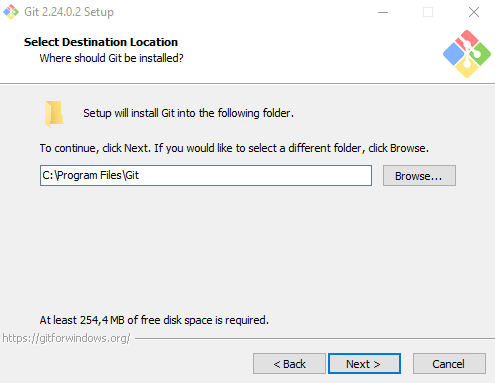
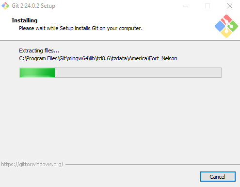
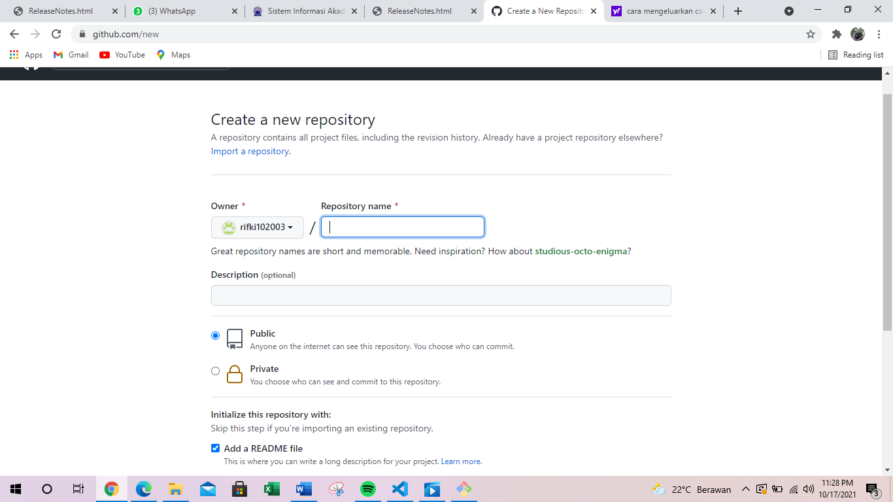
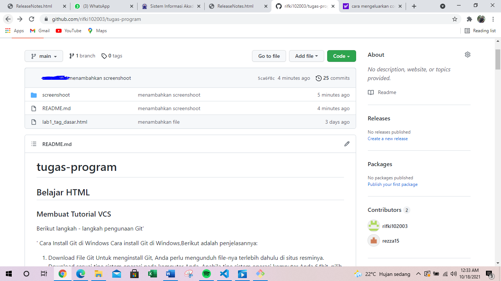
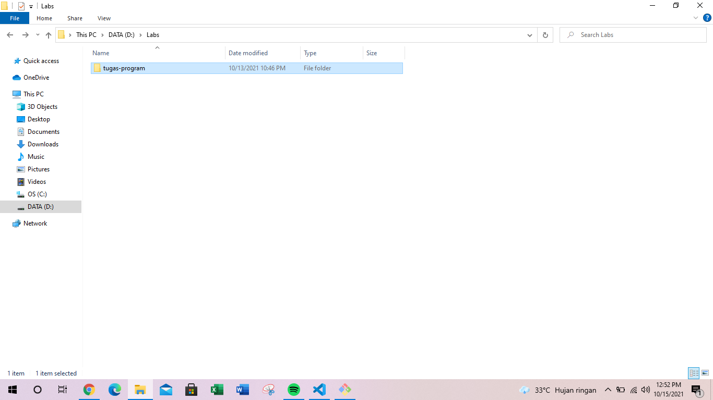
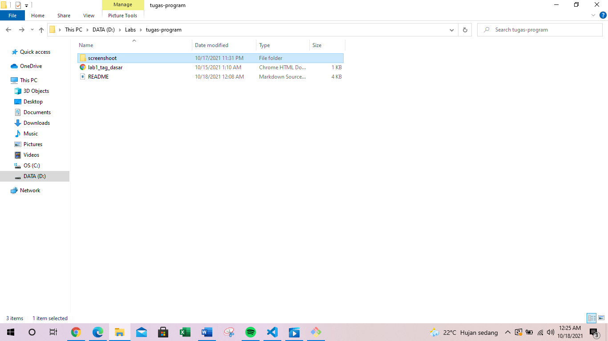

# tugas_program
## Belajar HTML

### Membuat Tutorial VCS
Berikut langkah - langkah pengguna Git'
'
Cara Install Git di Windows
Cara Instal Git di Windows, Berikut adalah penjelasannya:

1. Download File Git
Untuk menginstall Git, Anda perlu mengunduh file-nya terlebih dahulu di situs resminya. Download sesuai tipe sistem operasi pada komputer Anda. Apabila tipe sistem operasi komputer Anda 64bit, pilih Git yang mendukung Windows 64bit. Tujuannya adalah agar tidak terjadi error saat proses instalasi Git.

2. Install Git
Setelah selesai mengunduh file Git, buka setup aplikasi Git untuk memulai proses instalasi. Halaman awal setelah Anda membuka setup aplikasi Git adalah tampilan Document License dari Git. Klik Next untuk melanjutkan instalasi.

3. Tentukan Lokasi Instalasi Git Selanjutnya, pilih lokasi untuk install Git pada komputer Anda. Pada tutorial ini kami menginstall di lokasi C:\Program Files\Git. Setelah menentukan lokasi instalasi Git, klik Next untuk melanjutkan .

4. Pilih Komponen Tambahan Kemudian pilih komponen tambahan untuk install Git. Fungsi komponen ini adalah untuk memperlancar penggunaan Git dan mendukung file dengan kapasitas besar. Sesuaikan komponen tambahan yang dipilih seperti pada gambar di bawah ini. Jika sudah klik Next untuk melanjutkan instalasi.

5. Tentukan Nama Aplikasi Git Sebenarnya Anda bebas mengganti nama aplikasi Git yang akan ditampilkan pada Start Menu. Akan tetapi, demi kemudahan saat mencari aplikasi ini, sebaiknya gunakan nama Git saja.

6. Tentukan File Editor Untuk mengedit script melalui Git, Anda memerlukan file editor. Anda bebas menggunakan file editor apa pun untuk dikombinasikan dengan Git. Pada tutorial ini, kami menggunakan Vim Editor. Klik Next apabila Anda sudah menentukan file editor yang akan Anda gunakan.

7. Kalian bisa langsung next saja sampai menemukan klik install dan pilih Enable lalu tunggu sampai installasi selesai.

Login Github Langkah kedua dalam belajar menggunakan Git adalah Anda harus login ke dalam website GitHub. Github dan Git memiliki hubungan khusus, yaitu Git yang berperan sebagai version control system dan Github menjadi hosting atau sebagai penyimpan kode pemrograman. Setelah Anda login, akan muncul tampilan dashboard dari GitHub seperti gambar di bawah ini.

Kemudian Anda akan diarahkan pada halaman untuk membuat repository baru seperti gambar di bawah ini. Anda perlu mengisi detail informasi berikut: Nama Repository : digunakan untuk identitas repository yang dibuat. Deskripsi Repository : berfungsi untuk deskripsi dari repository yang dibuat. Jenis Repository : jenis repository dibagi menjadi Public dan Private. Ketika Anda mengatur repository menjadi Public, orang lain dapat melihat repository yang Anda buat. Sebaliknya, jika Anda mengaturnya sebagai Private, repository tersebut hanya bisa diakses oleh Anda. Setelah mengisi detail informasi di atas, klik Create Repository.

Lalu masuk ke aplikasi git yang sudah kita download,dan buat folder untuk reposytory di local disk D misalkan Labs,lalu masuk comand git dan ketik ($pwd)lalu ketik ($cd /d/labs/) labs adalah nama folder yang tadi kita buat di local disk d,ketik ($git clone masukan url dari akun github kita) jika sudah akan seperti ini.

Lalu akan muncul file readme dari github kita jika sudah di clone seperti ini.

Nah untuk memasukan folder reposytory yang ada di local disk D ke akun github kita dengan cara buka comand git lagi lalu ketik ($git status) lalu klik ($git push -u origin main).

yang diciptakan oleh Linus Torvalds. Pengontrol versi bertugas mencatat setiap perubahan pada file proyek yang dikerjakan oleh banyak orang maupun sendiri.Git dikenal juga dengan distributed revision control (VCS terdistribusi), artinya penyimpanan database Git tidak hanya berada dalam satu tempat saja.

Itu saha yang dapat saya paparkan mengenai git terimakasih wassalamuallaikum wr wb.
